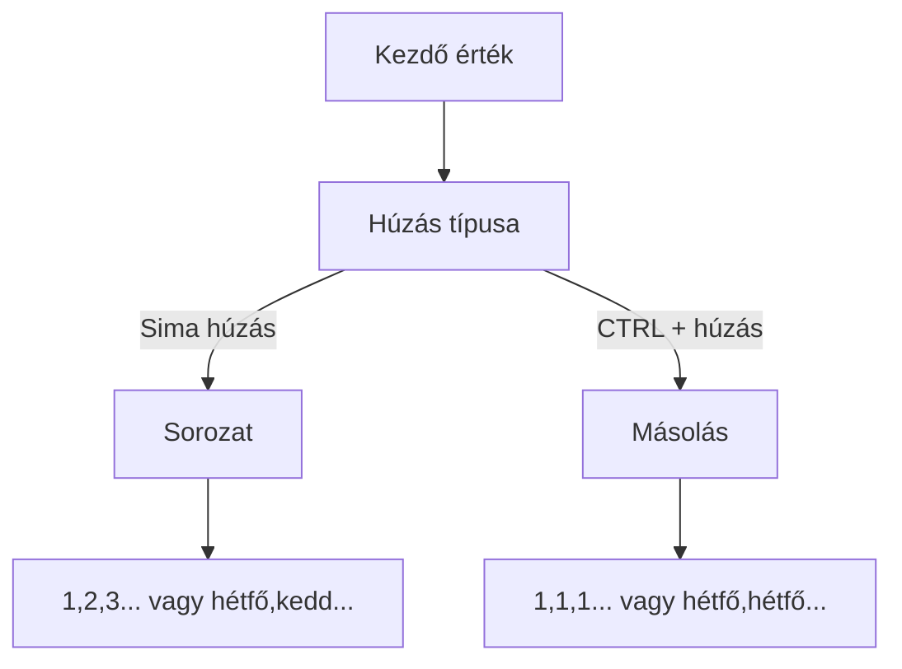

import Tabs from '@theme/Tabs';
import TabItem from '@theme/TabItem';

# Adatbevitel és formázások az Excelben

Az Excel hatékony használatának alapja az adatok megfelelő bevitele és formázása. Ebben a fejezetben megtanuljuk az alapvető technikákat.

## Adatbevitel a táblázatba 📝

### Billentyűzetes navigáció

:::tip Gyors navigáció
| Billentyű | Művelet |
|-----------|---------|
| ENTER | Lefelé lép |
| SHIFT + ENTER | Felfelé lép |
| TAB | Jobbra lép |
| SHIFT + TAB | Balra lép |
| ESC | Megszakítja a bevitelt |
:::

### Adattípusok és viselkedésük

<Tabs>
  <TabItem value="szoveg" label="Szöveg" default>
    ```
    Balra igazított
    Példák:
    - "Kovács Péter"
    - "9.A osztály"
    - "Term-001"
    ```
  </TabItem>
  <TabItem value="szam" label="Szám">
    ```
    Jobbra igazított
    Példák:
    - 42
    - 3.14
    - 1 000 000
    ```
  </TabItem>
  <TabItem value="datum" label="Dátum">
    ```
    Jobbra igazított
    Formátumok:
    - 2024.03.20
    - 2024. március 20.
    - 20/03/2024
    ```
  </TabItem>
  <TabItem value="logikai" label="Logikai">
    ```
    Középre igazított
    Értékek:
    - IGAZ vagy =IGAZ
    - HAMIS vagy =HAMIS
    ```
  </TabItem>
</Tabs>

### Automatikus kitöltés ⚡

Az Excel intelligens kitöltési funkciói időt spórolnak:



:::info Kitöltési minták
- Számok: 1, 2, 3... vagy 2, 4, 6...
- Hónapok: január, február, március...
- Napok: hétfő, kedd, szerda...
- Dátumok: 2024.01.01, 2024.01.02...
:::

## Formázási alapok 🎨

### Betűformázás

<details>
<summary><strong>Betűtípus és méret</strong></summary>

- Ajánlott betűtípusok:
  - Arial (sans-serif)
  - Calibri (sans-serif)
  - Times New Roman (serif)
- Ajánlott méretek:
  - Normál szöveg: 10-12pt
  - Címsorok: 14-16pt
</details>

<details>
<summary><strong>Stílusok és színek</strong></summary>

| Stílus | Billentyűparancs |
|--------|------------------|
| Félkövér | CTRL + B |
| Dőlt | CTRL + I |
| Aláhúzott | CTRL + U |
</details>

### Cellák formázása 📊

:::tip Pro tipp
A jól formázott táblázat nem csak szép, de könnyebben is értelmezhető!
:::

1. **Igazítás lehetőségek**
   ```
   Vízszintes: ◀ ▶ ↔
   Függőleges: ▲ ▼ ↕
   ```

2. **Szegélyek és kitöltések**
   ```
   ┌─────┐  Külső szegély
   │     │  Belső rács
   └─────┘  Színes háttér
   ```

3. **Számformátumok**
   ```
   1000 → 1 000
   0.5 → 50%
   42 → 42.00
   ```

## Gyakorlati példák 💡

### Órarend készítése

:::note Példa órarend struktúra
```
          Hétfő   Kedd    Szerda
1. óra    Matek   Magyar  Angol
2. óra    Fizika  Tesi    Biológia
```
Tippek:
- Használj pasztell háttérszíneket
- Egységes szegélyezést alkalmazz
- A fejlécet emeld ki félkövérrel
:::

### Születésnapi naptár

```jsx
// Javasolt struktúra
Név              Születési dátum    Életkor
Kovács Anna      2000.03.15        =MA()-A2
Nagy Béla        1999.07.22        =MA()-A3
```

## Praktikus tanácsok ⭐

### Formázási alapelvek

1. **Konzisztencia**
   - Egységes betűtípusok
   - Következetes színhasználat
   - Azonos cellastílusok

2. **Olvashatóság**
   ```
   ✅ Jó kontraszt
   ✅ Megfelelő méret
   ✅ Logikus elrendezés
   ❌ Túl sok szín
   ❌ Túl kicsi betűméret
   ```

3. **Professzionális megjelenés**
   - Használj előre definiált táblázatstílusokat
   - Alkalmazz következetes szegélyezést
   - Figyelj a sortávolságokra


## Ellenőrző kérdések ✅

<details>
<summary>1. Hogyan lehet új sort kezdeni egy cellán belül?</summary>
ALT + ENTER billentyűkombinációval
</details>

<details>
<summary>2. Mi a különbség a CTRL+húzás és sima húzás között az automatikus kitöltésnél?</summary>
CTRL+húzás: az első érték másolódik
Sima húzás: sorozat generálódik
</details>

<details>
<summary>3. Melyik adattípus igazodik alapértelmezetten jobbra?</summary>
A számok és dátumok igazodnak jobbra automatikusan
</details>
