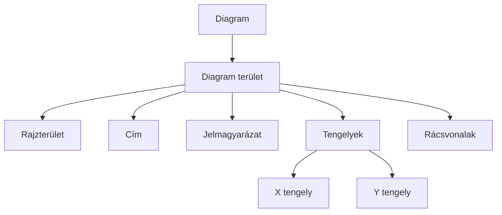
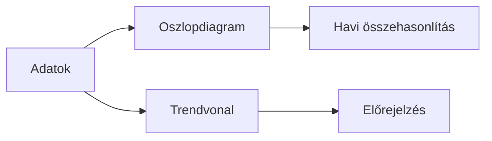

import Tabs from '@theme/Tabs';
import TabItem from '@theme/TabItem';

# Diagramok készítése és formázása 📊

## A diagram anatómiája 🔍



## Diagram típusok

<Tabs>
  <TabItem value="oszlop" label="Oszlopdiagram" default>
    ```mermaid
    graph TD
        A[Oszlopdiagram] --> B[Csoportosított]
        A --> C[Halmozott]
        A --> D[100%-ig halmozott]
        
        B --> E[Kategóriák összehasonlítása]
        C --> F[Részek és egész]
        D --> G[Százalékos megoszlás]
    ```
    
    :::tip Használat
    - Idősorok összehasonlítása
    - Kategóriák összevetése
    - Maximum 6-8 kategória esetén
    :::
  </TabItem>
  <TabItem value="kor" label="Kördiagram">
    :::warning Kördiagram szabályok
    1. Maximum 5-6 szelet
    2. Értékek összege 100%
    3. Szeleteket méret szerint rendezve
    4. Kis értékeket csoportosítva
    :::
    
    **Típusai:**
    - Klasszikus kör
    - Robbantott nézet
    - Fánk diagram
  </TabItem>
  <TabItem value="vonal" label="Vonaldiagram">
    :::info Mikor használjuk?
    - Folyamatos változások
    - Trendek bemutatása
    - Idősorok ábrázolása
    :::
    
    **Jellemzők:**
    ```jsx
    - Adatpontok összekötve
    - Opcionális jelölők
    - Simított/egyenes vonalak
    ```
  </TabItem>
</Tabs>

## Diagram készítése lépésről lépésre 📈

### 1. Adatok előkészítése

```excel
   A        B        C
1  Hónap   Bevétel  Kiadás
2  Január  1000     800
3  Február 1200     900
4  Március 1100     850
```

### 2. Diagram beszúrása

<details>
<summary>Gyorsbillentyűk és lépések</summary>

1. Adatok kijelölése
2. `ALT + F1` - gyors diagram
3. `F11` - új diagramlap
4. Vagy: Beszúrás > Diagram
</details>

### 3. Diagram testreszabása

<Tabs>
  <TabItem value="elrendezes" label="Elrendezés" default>
    ```
    1. Diagram elrendezése
       - Cím pozíciója
       - Jelmagyarázat helye
       - Tengely beállítások
    ```
  </TabItem>
  <TabItem value="stilus" label="Stílus">
    ```
    2. Megjelenés
       - Színséma választás
       - Betűtípusok
       - Effektek
    ```
  </TabItem>
  <TabItem value="adatok" label="Adatok">
    ```
    3. Adatok megjelenítése
       - Adatfeliratok
       - Hiányzó értékek
       - Trendvonalak
    ```
  </TabItem>
</Tabs>

## Haladó diagram technikák ⚡

### Kombinált diagramok

```jsx
// Példa: Bevétel-Profit diagram
Bevétel: Oszlopdiagram (elsődleges tengely)
Profit%: Vonaldiagram (másodlagos tengely)

// Beállítások
1. Adatsor hozzáadása
2. Diagram típus módosítása
3. Tengely váltása
```

### Trendvonalak és előrejelzés

:::tip Trendvonal típusok
- Lineáris: egyenletes változás
- Exponenciális: gyorsuló változás
- Mozgóátlag: ingadozások simítása
:::

```excel
// Trendvonal hozzáadása
1. Jobb klikk az adatsoron
2. Trendvonal hozzáadása
3. Típus választás
4. Előrejelzés beállítása
```

### Dinamikus diagramok

```excel
// Dinamikus tartomány
=OFFSET(kezdőcella; 0; 0; DARAB2(adatok); 1)

// Diagram frissítése
1. Automatikus méretezés
2. Név kezelő használata
3. Táblázat hivatkozások
```

## Gyakorlati példák 💡

### 1. Értékesítési jelentés



### 2. Költségvetés elemzés

<details>
<summary><strong>Kördiagram + Oszlopdiagram kombináció</strong></summary>

```
1. Kördiagram: Költségek megoszlása
2. Oszlopdiagram: Havi trend
3. Szűrők:
   - Időszak
   - Kategória
   - Részleg
```
</details>

## Formázási tippek ⭐

1. **Színhasználat**
   ```
   - Maximálisan 6-7 szín
   - Kontrasztos színek
   - Jelentéssel bíró színek
   ```

2. **Feliratok**
   ```
   - Olvasható méret
   - Forgatás ha szükséges
   - Rövidítések használata
   ```

3. **Elrendezés**
   ```
   - Arányos méretezés
   - Üres helyek kitöltése
   - Logikus elemfelhelyezés
   ```

## Gyakori hibák és megoldások ⚠️

| Hiba | Megoldás |
|------|----------|
| Túlzsúfolt diagram | Adatok szűrése vagy csoportosítása |
| Nehezen olvasható | Betűméret növelése, forgatás |
| Félrevezető skála | Nulláról indítás, helyes léptékek |


## Ellenőrző kérdések ✅

<details>
<summary>1. Melyik diagramtípust válasszuk idősorok ábrázolásához?</summary>

- Vonaldiagram: folyamatos változások
- Oszlopdiagram: diszkrét időpontok
</details>

<details>
<summary>2. Hogyan készítsünk kombinált diagramot?</summary>

1. Alap diagram létrehozása
2. Új adatsor hozzáadása
3. Adatsor típusának módosítása
4. Másodlagos tengely beállítása
</details>
