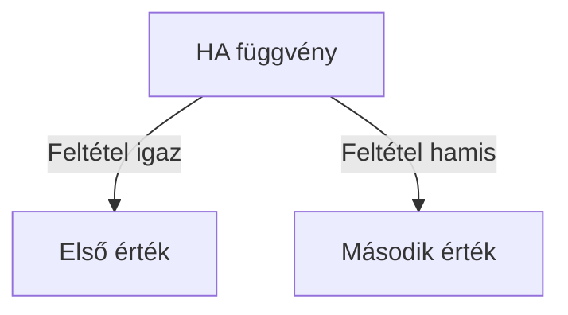

import Tabs from '@theme/Tabs';
import TabItem from '@theme/TabItem';

# Feltételes, szöveg- és dátumkezelő függvények 🧮

## Feltételes függvények 🤔

### A HA függvény

:::tip A HA függvény lényege
Döntéseket hozhatunk vele: "ha ez teljesül, akkor ezt csináld, különben azt"
:::



<Tabs>
  <TabItem value="szintaxis" label="Szintaxis" default>
    ```excel
    =HA(feltétel; ha_igaz; ha_hamis)
    ```
  </TabItem>
  <TabItem value="pelda" label="Egyszerű példa">
    ```excel
    =HA(A1>5; "Nagy szám"; "Kis szám")
    ```
  </TabItem>
  <TabItem value="gyakorlati" label="Gyakorlati példa">
    ```excel
    =HA(pontszám>=60; "Átment"; "Nem ment át")
    ```
  </TabItem>
</Tabs>

### Logikai műveletek

<details>
<summary><strong>ÉS függvény</strong> - minden feltételnek teljesülnie kell</summary>

```excel
=ÉS(A1>0; A1<100; A1<>50)
=HA(ÉS(kor>=18; kor<=65); "Aktív korú"; "Nem aktív korú")
```
</details>

<details>
<summary><strong>VAGY függvény</strong> - elég egy feltételnek teljesülnie</summary>

```excel
=VAGY(A1=1; A1=3; A1=5)
=HA(VAGY(státusz="aktív"; státusz="pending"); "Folyamatban"; "Lezárt")
```
</details>

### Összetett feltételek példái

```jsx
// Jegy értékelése
=HA(jegy>=5; "Kiváló";
  HA(jegy>=4; "Jó";
    HA(jegy>=3; "Közepes";
      HA(jegy>=2; "Elégséges"; "Elégtelen"))))

// Életkor kategorizálás
=HA(ÉS(kor>=18; kor<=25); "Fiatal felnőtt";
  HA(ÉS(kor>25; kor<=65); "Felnőtt"; "Egyéb"))
```

## Szövegkezelő függvények 📝

### Alapvető szövegműveletek

| Függvény | Leírás | Példa | Eredmény |
|----------|---------|--------|----------|
| ÖSSZEFŰZ | Szövegek egyesítése | `=ÖSSZEFŰZ("Hello";" ";"Világ")` | Hello Világ |
| BAL | Bal oldali karakterek | `=BAL("Excel";2)` | Ex |
| KÖZÉP | Középső karakterek | `=KÖZÉP("Excel";2;2)` | xc |
| JOBB | Jobb oldali karakterek | `=JOBB("Excel";2)` | el |
| HOSSZ | Szöveg hossza | `=HOSSZ("Excel")` | 5 |

### Szövegformázó függvények

<Tabs>
  <TabItem value="betumeret" label="Betűméret" default>
    ```excel
    =KISBETŰ("EXCEL")   → "excel"
    =NAGYBETŰ("excel")  → "EXCEL"
    ```
  </TabItem>
  <TabItem value="tisztitas" label="Tisztítás">
    ```excel
    =HELYETTE("Excel-2024", "-", "")  → "Excel2024"
    =SZÖVEG.KERES("xl", A1)           → megkeresi az "xl" pozícióját
    ```
  </TabItem>
</Tabs>

## Dátumkezelő függvények 📅

### Aktuális dátum és idő

:::info Fontos
Az Excel a dátumokat számként tárolja:
- 1 = 1900. január 1.
- MA() = mai nap sorszáma
:::

```excel
=MA()                   // Aktuális dátum
=MOST()                 // Aktuális dátum és idő
=DÁTUM(2024;3;15)      // Konkrét dátum létrehozása
```

### Dátum komponensek

```jsx
// Dátum részei
=ÉV(A1)          // Év kinyerése
=HÓNAP(A1)       // Hónap kinyerése (1-12)
=NAP(A1)         // Nap kinyerése

// Dátum számítások
=NAPOK(B1;A1)    // Eltelt napok száma
=HÓNAP.NAPJA(A1) // Hónap utolsó napja
```

## Gyakorlati alkalmazások 💡

### Tanulmányi értékelő rendszer

```excel
// Komplex értékelés
=HA(átlag>=4.5;"Kitűnő";
  HA(átlag>=4;"Jó";
    HA(átlag>=3;"Megfelelt";
      HA(átlag>=2;"Fejlesztendő";"Kritikus"))))

// Státusz és színkód
=HA(ÉS(jegy1>=2;jegy2>=2;jegy3>=2);"Teljesített";"Nem teljesített")
```

### Könyvtári rendszer

```excel
// Késedelmi napok számítása
=HA(MA()-kölcsönzés_dátuma>30;
   (MA()-kölcsönzés_dátuma-30)*100;
   0)

// Státusz jelzés
=HA(VAGY(MA()-kölcsönzés_dátuma>30;állapot="sérült");
   "Intézkedés szükséges";"Rendben")
```

## Tippek és trükkök ⭐

1. **Feltételes formázás használata**
   ```excel
   // Szabály példa
   =ÉS(A1>=0;A1<=100)  // Érvényes százalék
   ```

2. **Dátumok kezelése**
   ```excel
   // Következő hónap első napja
   =DÁTUM(ÉV(MA());HÓNAP(MA())+1;1)
   ```

3. **Szövegek tisztítása**
   ```excel
   // Felesleges szóközök eltávolítása
   =HELYETTE(HELYETTE(A1;" ";"");"  ";" ")
   ```

## Hibakezelés és ellenőrzések ⚠️

<details>
<summary>Gyakori hibák és megoldások</summary>

| Hiba | Ok | Megoldás |
|------|-----|----------|
| #ÉRTÉK! | Nem megfelelő adattípus | Ellenőrizd a bemeneti adatokat |
| #NÉV? | Hibás függvénynév | Ellenőrizd a függvény helyesírását |
| #DIV/0! | Nullával osztás | Adj hozzá HA függvényt az ellenőrzéshez |

</details>


## Ellenőrző kérdések ✅

<details>
<summary>1. Mikor használjunk HA függvényt?</summary>

Amikor feltétel alapján szeretnénk különböző értékeket megjeleníteni.
```excel
=HA(feltétel; "ezt ha igaz"; "ezt ha hamis")
```
</details>

<details>
<summary>2. Hogyan fűzhetünk össze szövegeket?</summary>

Az ÖSSZEFŰZ függvénnyel vagy & operátorral:
```excel
=ÖSSZEFŰZ(A1; " "; B1)
=A1 & " " & B1
```
</details>

