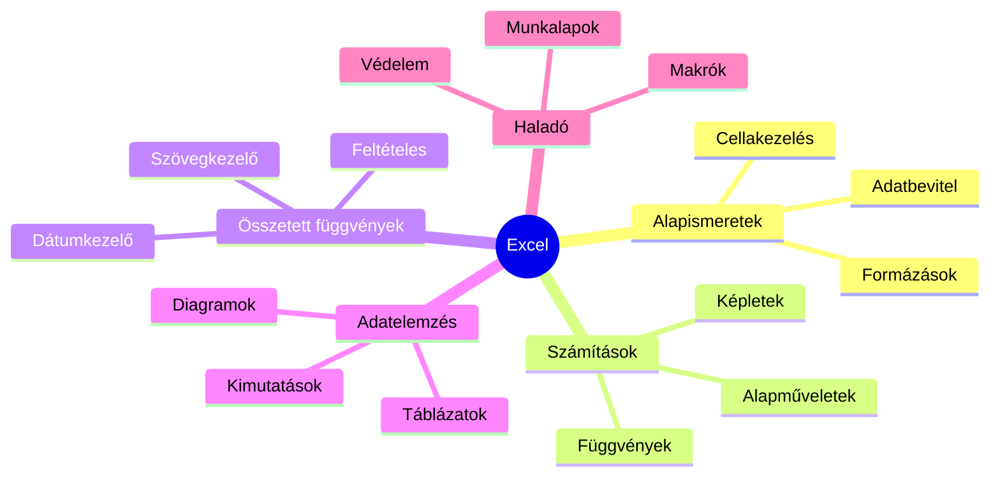
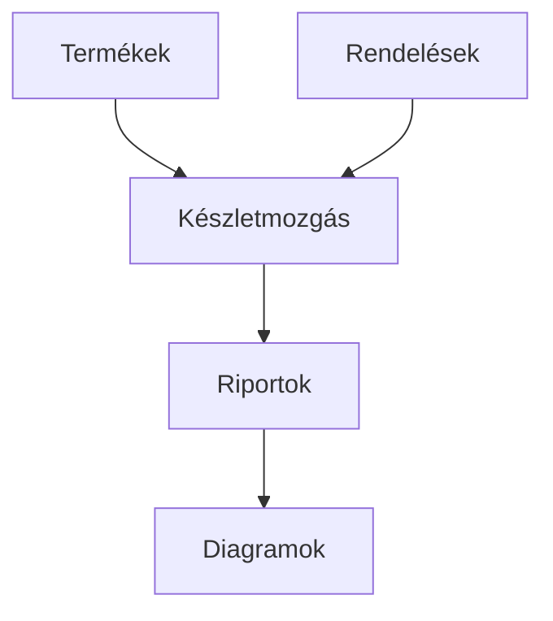

import Tabs from '@theme/Tabs';
import TabItem from '@theme/TabItem';

# Excel gyakorlás és feladatok 💪

## Tudásanyag áttekintése 📚



## Gyakorló feladatok

### 1. Osztály félévi eredményeinek elemzése 📊

<Tabs>
  <TabItem value="leiras" label="Feladat leírása" default>
    :::info Alapadatok
    - 9.A osztály félévi jegyei
    - 5 tantárgy: Matematika, Magyar, Történelem, Angol, Informatika
    - 20 tanuló adatai
    :::

    **Bemeneti formátum (osztalyzatok.csv):**
    ```csv
    Név;Matematika;Magyar;Történelem;Angol;Informatika
    Kovács Anna;4;5;4;5;5
    ...
    ```
  </TabItem>
  <TabItem value="feladatok" label="Feladatok">
    1. **Adatok formázása**
       ```
       □ Táblázat kialakítása
       □ Fejlécek formázása
       □ Cellaformátumok beállítása
       ```

    2. **Számítások**
       ```
       □ Tanulói átlagok
       □ Tantárgyi átlagok
       □ Min/Max értékek
       ```

    3. **Feltételes formázás**
       ```
       □ 4,5 felett: zöld
       □ 2,5 alatt: piros
       □ Elégtelen: piros háttér
       ```
  </TabItem>
  <TabItem value="tippek" label="Segítség">
    ```excel
    // Hasznos függvények
    =ÁTLAG()     // Átlagszámításhoz
    =MIN()       // Minimum érték
    =MAX()       // Maximum érték
    =DARAB()     // Darabszámolás
    
    // Feltételes formázás
    Kezdőlap → Feltételes formázás
    ```
  </TabItem>
</Tabs>

### 2. Mini webshop készletkezelő 🛍️

<details>
<summary><strong>Rendszer felépítése</strong></summary>



**Munkalapok:**
1. Termékek
2. Rendelések
3. Készletmozgás
4. Riportok
</details>

<details>
<summary><strong>Megvalósítandó funkciók</strong></summary>

1. **Keresőrendszer**
   ```excel
   =FKERES()     // Termékadatok keresése
   =INDEX(HOL.VAN())  // Összetett keresés
   ```

2. **Automatikus számítások**
   ```excel
   // Készletszámítás
   =SZUM(bevételezés) - SZUM(kiadás)
   
   // Árrés kalkuláció
   =(eladási_ár - beszerzési_ár)/beszerzési_ár
   ```
</details>

### 3. Családi költségvetés tervező 💰

:::tip Struktúra
```
📋 Bevételek
  ├── Rendszeres
  ├── Eseti
  └── Megtakarítások

📋 Kiadások
  ├── Fix költségek
  ├── Változó költségek
  └── Kategóriák

📊 Elemzések
  ├── Kimutatások
  ├── Trendek
  └── Célok követése
```
:::

## Gyakorlati tanácsok ⭐

### Tervezési módszertan

1. **Előkészítés**
   ```
   1. Adatszerkezet tervezése
   2. Munkalapok kapcsolatai
   3. Szükséges függvények listája
   ```

2. **Megvalósítás**
   ```
   1. Adatbeviteli felület
   2. Számítások implementálása
   3. Elemzések, kimutatások
   ```

### Értékelési szempontok

| Szempont | Súly | Példa |
|----------|------|--------|
| Funkcionalitás | 40% | Működő képletek |
| Felhasználóbarát | 30% | Átlátható elrendezés |
| Védelem | 15% | Képletvédelem |
| Megjelenés | 15% | Egységes formázás |

## Hibakezelés és tesztelés 🔍

### Gyakori hibák elkerülése

<details>
<summary><strong>Képlethibák megelőzése</strong></summary>

```excel
// Hibakezelés példák
=HAHIBA(képlet; "Hiba történt!")
=HA(SZÁM(érték); számítás; "Érvénytelen adat")
```
</details>

<details>
<summary><strong>Adatellenőrzés</strong></summary>

```excel
// Adatérvényesítés
1. Adatok → Adatérvényesítés
2. Megfelelő szabályok
3. Hibaüzenetek beállítása
```
</details>


## Ellenőrző lista ✅

<details>
<summary>A feladat beadása előtt...</summary>

□ Minden képlet működik?
□ Az adatok helyesen jelennek meg?
□ A védelem megfelelően működik?
□ A formázás egységes?
□ A diagramok érthetőek?
□ A dokumentáció teljes?
</details>
