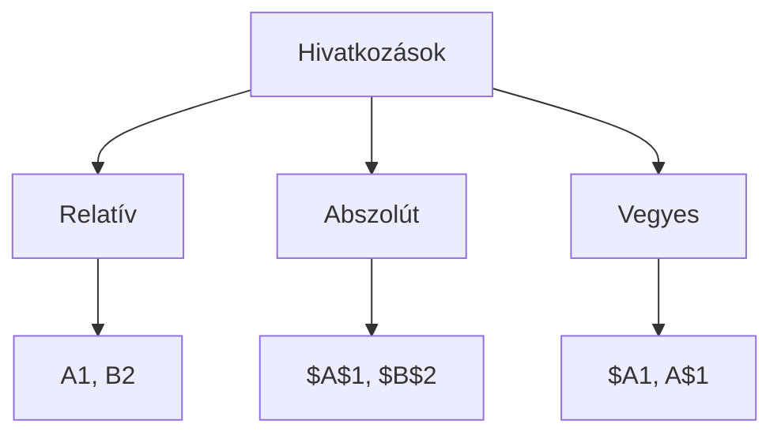

import Tabs from '@theme/Tabs';
import TabItem from '@theme/TabItem';

# Képletek és függvények az Excelben 🧮

A képletek és függvények jelentik az Excel igazi erejét. Segítségükkel automatizálhatjuk számításainkat és elemzéseinket.

## Képletek alapjai 📐

:::tip A képletek aranyszabálya
Minden képlet egyenlőségjellel (=) kezdődik!
:::

### Matematikai műveletek

<Tabs>
  <TabItem value="alapmuveletek" label="Alapműveletek" default>

  | Művelet | Jel | Példa | Eredmény |
  |---------|-----|--------|----------|
  | Összeadás | + | =2+3 | 5 |
  | Kivonás | - | =5-2 | 3 |
  | Szorzás | * | =4*3 | 12 |
  | Osztás | / | =10/2 | 5 |
  | Hatványozás | ^ | =2^3 | 8 |

  </TabItem>
  <TabItem value="precedencia" label="Műveleti sorrend">

  1. Zárójelek `()`
  2. Hatványozás `^`
  3. Szorzás `*` és osztás `/`
  4. Összeadás `+` és kivonás `-`

  ```
  =2+3*4    → 14  (először: 3*4=12, majd 2+12=14)
  =(2+3)*4  → 20  (először: 2+3=5, majd 5*4=20)
  ```
  </TabItem>
</Tabs>

## Hivatkozások típusai 🔗



### Viselkedésük másoláskor

<Tabs>
  <TabItem value="relativ" label="Relatív" default>
    ```
    Eredeti:  =A1+B1
    Másolva:  =A2+B2 (egy sorral lejjebb)
    ```
    A hivatkozás a másolás irányának megfelelően változik
  </TabItem>
  <TabItem value="abszolut" label="Abszolút">
    ```
    Eredeti:  =$A$1+$B$1
    Másolva:  =$A$1+$B$1 (nem változik)
    ```
    A $ jel rögzíti a sort és oszlopot
  </TabItem>
  <TabItem value="vegyes" label="Vegyes">
    ```
    Eredeti:  =$A1+B$1
    Másolva:  =$A2+B$1 (csak a nem $-os rész változik)
    ```
    Részleges rögzítés lehetséges
  </TabItem>
</Tabs>

:::info Profi tipp
Az F4 billentyű többszöri megnyomásával válthatunk a hivatkozási típusok között:
A1 → $A$1 → A$1 → $A1 → A1
:::

## Alapvető függvények 📊

### Összesítő függvények

```jsx
// Példa adatok
   A    B    C
1  10   20   30
2  15   25   35
3  20   30   40
```

<details>
<summary><strong>SZUM függvény</strong></summary>

```excel
=SZUM(A1:A3)      // Eredmény: 45 (10+15+20)
=SZUM(A1:C1)      // Eredmény: 60 (10+20+30)
=SZUM(A1:C3)      // Eredmény: 225 (összes szám)
```
</details>

<details>
<summary><strong>ÁTLAG függvény</strong></summary>

```excel
=ÁTLAG(A1:A3)     // Eredmény: 15 ((10+15+20)/3)
=ÁTLAG(A1:C1)     // Eredmény: 20 ((10+20+30)/3)
```
</details>

<details>
<summary><strong>MIN és MAX függvények</strong></summary>

```excel
=MIN(A1:C3)       // Eredmény: 10 (legkisebb szám)
=MAX(A1:C3)       // Eredmény: 40 (legnagyobb szám)
```
</details>

### Számláló függvények

<Tabs>
  <TabItem value="darab" label="DARAB" default>
    Megszámolja a számokat tartalmazó cellákat
    ```excel
    =DARAB(A1:C3)     // Számok mennyisége
    ```
  </TabItem>
  <TabItem value="darab2" label="DARAB2">
    Megszámolja a nemüres cellákat
    ```excel
    =DARAB2(A1:C3)    // Nemüres cellák száma
    ```
  </TabItem>
</Tabs>

## Gyakori hibák és megoldásaik ⚠️

| Hibaüzenet | Jelentés | Megoldás |
|------------|----------|----------|
| #HIV! | Hibás hivatkozás | Ellenőrizd a cellahivatkozásokat |
| #NÉV? | Ismeretlen név | Ellenőrizd a függvény nevét |
| #ZÉRÓOSZTÓ! | Nullával osztás | Ellenőrizd az osztót |
| #ÉRTÉK! | Nem megfelelő érték | Ellenőrizd az adattípusokat |

## Gyakorlati példák 💡

### Osztálynapló példa

```excel
       A         B    C    D    E      F           G
1    Név       M1   M2   M3   M4    Átlag      Legjobb
2  Anna        5    4    3    5   =ÁTLAG(B2:E2) =MAX(B2:E2)
3  Béla        4    5    5    4   =ÁTLAG(B3:E3) =MAX(B3:E3)
```

### Költségvetés példa

```excel
       A          B        C            D
1    Tétel     Összeg   ÁFA(27%)    Végösszeg
2  Bevétel    100000  =B2*0,27   =B2+C2
```

## Haladó tippek ⭐

1. **Függvényvarázsló használata**
   - Kattints az fx gombra
   - Válaszd ki a kategóriát
   - Követd a varázsló lépéseit

2. **Függvények egymásba ágyazása**
   ```excel
   =KEREKÍTÉS(ÁTLAG(A1:A10);2)  // Átlag kerekítve 2 tizedesre
   ```

3. **Tömbképletek használata**
   ```excel
   =SZUM(B2:B10*C2:C10)  // Szorzatok összege
   ```


## Ellenőrző kérdések ✅

<details>
<summary>1. Mi a különbség a relatív és abszolút hivatkozás között?</summary>

- **Relatív:** Másoláskor változik (pl. A1 → A2)
- **Abszolút:** Másoláskor nem változik (pl. $A$1 → $A$1)
</details>

<details>
<summary>2. Hogyan számolhatjuk ki több szám átlagát?</summary>

```excel
=ÁTLAG(tartomány)
Például: =ÁTLAG(A1:A10)
```
</details>

<details>
<summary>3. Mit jelent a #HIV! hibaüzenet?</summary>

A hivatkozás érvénytelen vagy nem létező cellára mutat.
</details>
