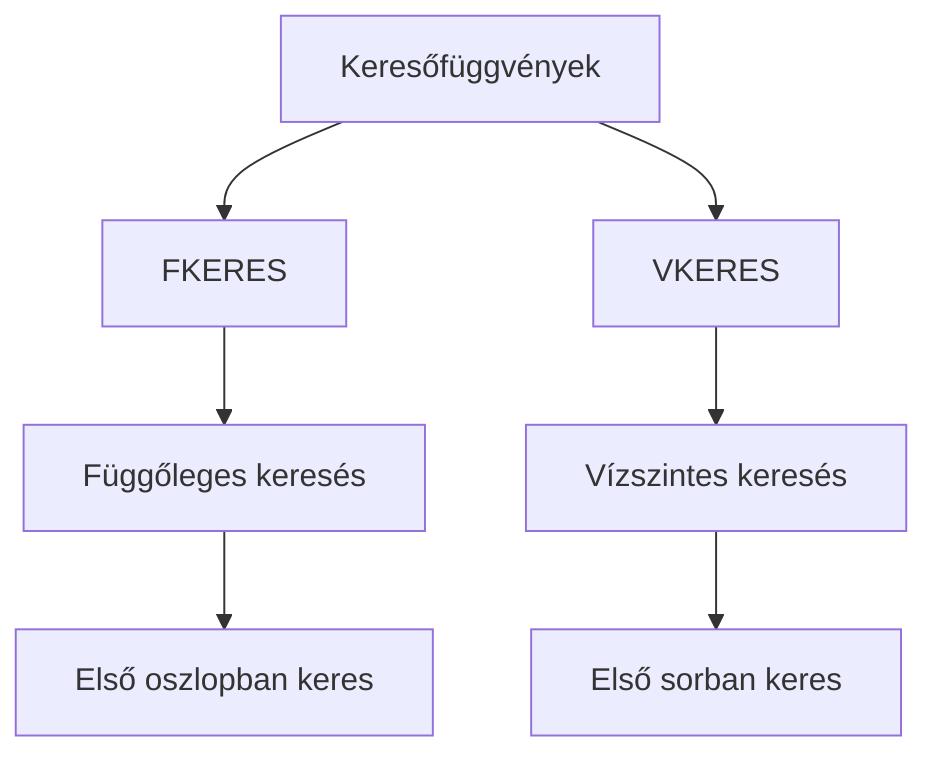
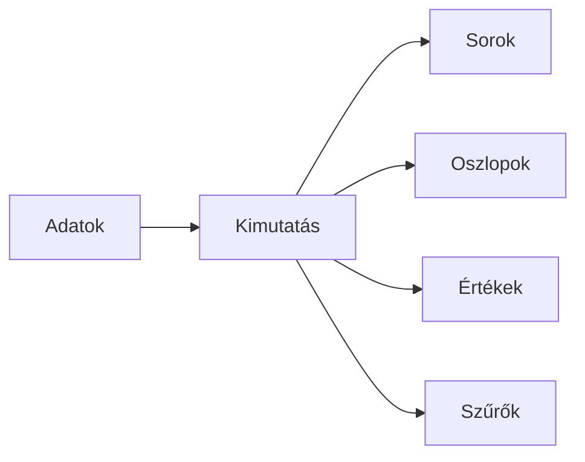

import Tabs from '@theme/Tabs';
import TabItem from '@theme/TabItem';

# Keresőfüggvények és kimutatások 🔍

## Keresőfüggvények

### FKERES vs VKERES



<Tabs>
  <TabItem value="fkeres" label="FKERES" default>
    ```excel
    =FKERES(
      mit_keres;     // Keresett érték
      hol_keres;     // Táblázat tartomány
      hanyadik_oszlop; // Visszaadandó oszlop száma
      pontos_egyezés  // HAMIS=részleges egyezés is jó
    )
    ```
    
    :::tip Példa
    ```excel
    // Termékár keresése kód alapján
    =FKERES("ABC123"; A2:C10; 3; HAMIS)
    ```
    :::
  </TabItem>
  <TabItem value="vkeres" label="VKERES">
    ```excel
    =VKERES(
      mit_keres;    // Keresett érték
      hol_keres;    // Táblázat tartomány
      hanyadik_sor; // Visszaadandó sor száma
      pontos_egyezés // HAMIS=részleges egyezés is jó
    )
    ```
    
    :::tip Példa
    ```excel
    // Negyedéves adat keresése
    =VKERES("Q1"; A1:E5; 3; HAMIS)
    ```
    :::
  </TabItem>
</Tabs>

### INDEX és HOL.VAN kombináció

:::info Rugalmasabb keresés
Az INDEX-HOL.VAN kombinációval bármely irányban kereshetünk, és több feltételt is használhatunk.
:::

```jsx
// Szintaxis
=INDEX(
  visszaadandó_tartomány,  // Honnan adjuk vissza az értéket
  HOL.VAN(                 // A keresett érték pozíciója
    mit_keresünk,
    hol_keresünk,
    0 // pontos egyezés
  )
)

// Példa
=INDEX(C2:C100; HOL.VAN("ABC123"; A2:A100; 0))
```

## Táblázatok kezelése 📊

### Táblázattá alakítás 

1. **Gyorsbillentyű**: `CTRL + T`
2. **Előnyök**:
   ```
   ✓ Automatikus formázás
   ✓ Dinamikus hivatkozások
   ✓ Beépített szűrők
   ✓ Automatikus bővülés
   ```

### Táblázat műveletek

<details>
<summary><strong>Formázási lehetőségek</strong></summary>

- Előre definiált stílusok
- Sávos sorok/oszlopok
- Összegző sor
- Egyedi formázás
</details>

<details>
<summary><strong>Szűrés és rendezés</strong></summary>

```excel
// Szűrési lehetőségek
- Érték szerint
- Szín szerint
- Egyedi szűrő
  - Tartalmaz
  - Nagyobb mint
  - Kezdődik...
```
</details>

## Kimutatások (Pivot táblák) 📈

### Kimutatás alapjai



### Kimutatás készítése

<Tabs>
  <TabItem value="elokeszites" label="Előkészítés" default>
    1. Adatok ellenőrzése
       - Nincsenek üres sorok
       - Minden oszlopnak van fejléce
       - Konzisztens adattípusok
    
    2. Kijelölés
       - Teljes adattartomány
       - Vagy táblázat hivatkozás
  </TabItem>
  <TabItem value="letrehozas" label="Létrehozás">
    1. Beszúrás > Kimutatás
    2. Mezők elhelyezése:
       ```
       Sorok ─── Mit szeretnénk részletezni?
       Oszlopok ─ Milyen bontásban?
       Értékek ── Mit szeretnénk összesíteni?
       Szűrők ─── Milyen feltételekkel?
       ```
  </TabItem>
  <TabItem value="testreszabas" label="Testreszabás">
    ```excel
    // Számítási módok
    - Összeg
    - Darabszám
    - Átlag
    - Min/Max
    - Egyedi számítás
    
    // Megjelenítés
    - Részösszegek
    - Összegző sorok
    - Csoportosítás
    ```
  </TabItem>
</Tabs>

### Gyakorlati példa - Értékesítési riport

```jsx
// Adatok struktúrája
Dátum | Termék | Régió | Mennyiség | Érték

// Kimutatás beállítások
Sorok: Termék
Oszlopok: Régió
Értékek: 
  - Mennyiség (Összeg)
  - Érték (Összeg)
Szűrők: Dátum

// További számítások
- Részesedés százalékban
- Előző időszakhoz képesti változás
- Termékenkénti átlagár
```

## Gyakorlati tippek ⭐

### Keresőfüggvényeknél

1. **Hibakezelés**
   ```excel
   =HAHIBA(
     FKERES(...);
     "Nem található"
   )
   ```

2. **Pontos egyezés vs. Közelítő keresés**
   ```excel
   // Pontos egyezés
   =FKERES("ABC123"; A2:C10; 3; HAMIS)
   
   // Közelítő keresés
   =FKERES(100; A2:C10; 3; IGAZ)  // Rendezett adatoknál!
   ```

### Kimutatásoknál

1. **Gyorselemzés**
   - `ALT + Q`: Gyorselemzés panel megnyitása
   - Javasolt vizualizációk
   - Gyors formázás

2. **Frissítés**
   ```excel
   // Kézi frissítés: F5
   // Automatikus frissítés beállítása:
   Kimutatás > Elemzés > Frissítés
   ```


## Ellenőrző kérdések ✅

<details>
<summary>1. Mi a fő különbség az FKERES és VKERES között?</summary>

Az FKERES függőlegesen (oszlopokban), míg a VKERES vízszintesen (sorokban) keres.
</details>

<details>
<summary>2. Mikor használjunk INDEX-HOL.VAN kombinációt?</summary>

Amikor rugalmasabb keresésre van szükség, vagy amikor az FKERES/VKERES nem elég (pl. többszörös feltételek, dinamikus oszlopszám).
</details>

<details>
<summary>3. Mely mezőtípusok léteznek egy kimutatásban?</summary>

- Sorok (kategorizálás)
- Oszlopok (kereszttáblás megjelenítés)
- Értékek (számítások)
- Szűrők (adatok szűkítése)
</details>
