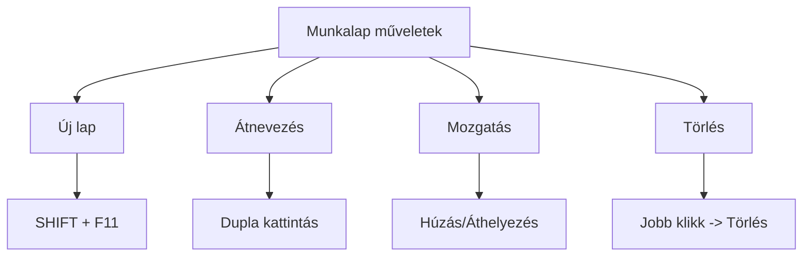
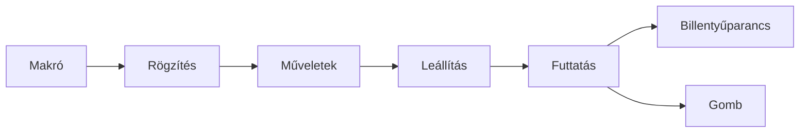

import Tabs from '@theme/Tabs';
import TabItem from '@theme/TabItem';

# Munkalapok és munkafüzetek kezelése 📑

## Munkalapok szervezése 📋

### Alapműveletek áttekintése



### Gyorsbillentyűk és műveletek

<Tabs>
  <TabItem value="alap" label="Alapműveletek" default>
    ```
    SHIFT + F11    → Új munkalap
    CTRL + PgUp    → Előző lap
    CTRL + PgDown  → Következő lap
    ALT + E + L    → Lap törlése
    ```
  </TabItem>
  <TabItem value="szervezes" label="Szervezés">
    ```
    CTRL + kattintás   → Több lap kijelölése
    SHIFT + kattintás  → Tartomány kijelölése
    ALT + húzás        → Lap másolása
    ```
  </TabItem>
</Tabs>

## Munkafüzet kezelés 📚

### Fájlformátumok és kompatibilitás

:::info Munkafüzet típusok
| Kiterjesztés | Leírás | Használat |
|--------------|---------|-----------|
| .xlsx | Standard Excel fájl | Általános használat |
| .xlsm | Makrókat tartalmazó | Automatizáláshoz |
| .xltx | Excel sablon | Újrafelhasználható sablonok |
| .pdf | Nem szerkeszthető | Megosztáshoz |
:::

### Munkafüzet védelem szintjei

<details>
<summary><strong>1. Alapszintű védelem</strong></summary>

```excel
// Munkafüzet szerkezetének védelme
Fájl → Információ → Munkafüzet védelme

// Jelszavas védelem beállítása
1. Megnyitás korlátozása
2. Szerkesztés korlátozása
3. Jelszó megadása
```
</details>

<details>
<summary><strong>2. Megosztási beállítások</strong></summary>

```excel
// Jogosultságok beállítása
- Csak olvasás
- Szerkesztés engedélyezése
- Tartományok védelme

// Véglegesítés
- Ellenőrzés
- Megjegyzések törlése
- Tulajdonságok beállítása
```
</details>

## Makrók programozása ⚡

### Makró anatómiája



### Makró készítése és használata

<Tabs>
  <TabItem value="rogzites" label="Rögzítés" default>
    1. **Előkészületek**
       ```excel
       - Nézet → Makrók → Makró rögzítése
       - Név megadása (ékezet nélkül)
       - Billentyűparancs beállítása
       ```
    
    2. **Műveletek rögzítése**
       ```excel
       - Pontos, átgondolt végrehajtás
       - Kerüljük a felesleges kattintásokat
       - Relatív/abszolút hivatkozások
       ```
  </TabItem>
  <TabItem value="futtatas" label="Futtatás">
    ```excel
    // Futtatási lehetőségek
    1. Billentyűparanccsal
    2. Makrók listából
    3. Gombról
    
    // Gomb létrehozása
    1. Fejlesztőeszközök → Beszúrás
    2. Form Control kiválasztása
    3. Makró hozzárendelése
    ```
  </TabItem>
</Tabs>

### Gyakorlati példák

```jsx
// 1. Formázó makró
=MAKRÓ Formatozas()
  - Betűtípus: Arial, 11pt
  - Cellaszín: világosszürke
  - Szegély: vékony keret
  - Igazítás: középre

// 2. Rendező makró
=MAKRÓ Rendezes()
  - Szűrők bekapcsolása
  - Rendezés: A-Z
  - Üres sorok törlése
  - Első sor rögzítése
```

## Munkalapok közötti hivatkozások 🔗

### Hivatkozási technikák

```excel
// Egyszerű hivatkozás
=Lap1!A1         // Konkrét cella
=Lap2!$A$1       // Abszolút hivatkozás

// Tartomány hivatkozás
=SZUM(Lap1!A1:A10)   // Egy lap tartománya
=ÁTLAG(Lap1:Lap4!A1) // Több lap azonos cellája

// Nevesített tartományok
=Termékek           // Névvel ellátott tartomány
=FKERES(B2;Árlista;2;HAMIS)  // Névvel ellátott tábla
```

## Gyakorlati tippek ⭐

### 1. Munkafüzet szervezés

```excel
// Lapok logikus rendezése
1. Adatbeviteli lapok
2. Számítási lapok
3. Összesítő lapok
4. Diagram lapok

// Színkódolás
- Adatbevitel: zöld
- Számítások: kék
- Összesítők: sárga
```

### 2. Hatékony munka makrókkal

:::tip Pro tippek
1. Készíts biztonsági másolatot rögzítés előtt
2. Használj beszédes makró neveket
3. Dokumentáld a makrók funkcióit
4. Teszteld különböző helyzetekben
:::

### 3. Védelem beállítása

```excel
// Ajánlott védelmi beállítások
1. Cellavédelem feloldása szerkeszthető celláknál
2. Képletek elrejtése
3. Lapszerkezet védelme
4. Erős jelszavak használata
```

## Hibakezelés ⚠️

<details>
<summary><strong>Gyakori problémák és megoldások</strong></summary>

| Probléma | Megoldás |
|----------|----------|
| Elveszett jelszó | Nincs megoldás, készíts biztonsági másolatot |
| Makró nem fut | Ellenőrizd a biztonsági beállításokat |
| Törött hivatkozások | Használj relatív hivatkozásokat |

</details>


## Ellenőrző kérdések ✅

<details>
<summary>1. Hogyan lehet több munkalapot egyszerre kijelölni?</summary>

CTRL + kattintás a lapfülekre, vagy SHIFT + kattintás tartomány kijelöléséhez
</details>

<details>
<summary>2. Mikor használjunk makrókat?</summary>

- Ismétlődő műveleteknél
- Szabványos formázásoknál
- Rendszeres adatfeldolgozásnál
</details>
